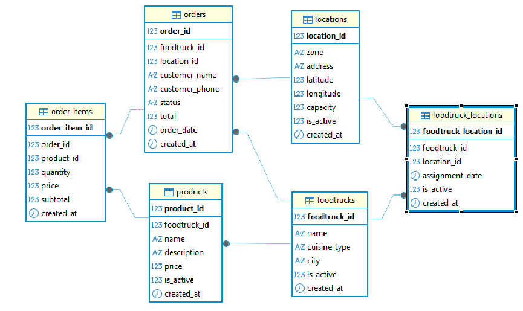

# foodtrack-db
Repositorio para el proyecto de Foodtrack-Henry

FoodTrack es una plataforma integral diseñada para gestionar y optimizar las operaciones de foodtrucks en entornos urbanos. El sistema centraliza la información de múltiples foodtrucks, sus ubicaciones, productos y pedidos, facilitando la administración de operaciones móviles de comida en una ciudad. Utilizando un esquema relacional en Microsoft SQL Server, el sistema organiza los datos mediante relaciones 1:N (como un foodtruck que ofrece múltiples productos) y N:M (como foodtrucks que operan en múltiples ubicaciones), asegurando integridad referencial y consistencia.

La plataforma digitaliza la gestión de flotas de foodtrucks mediante componentes clave: gestión de foodtrucks (registro, estado operativo, historial), administración de ubicaciones (mapeo de puntos estratégicos, control de capacidad), catálogo de productos (inventario, precios, stock) y sistema de pedidos (seguimiento de estado, cálculos automáticos). Desarrollada con SQL Server y gestionada mediante DBeaver, incluye control de versiones con Git/GitHub y sigue un modelo dimensional con tablas de hechos y dimensiones para análisis eficiente.

FoodTrack ofrece beneficios significativos: centralización de información operativa, optimización de rutas, análisis de ventas por foodtruck, mejora en la experiencia del cliente y toma de decisiones basada en datos. Permite a los administradores visualizar ubicaciones en tiempo real, gestionar menús centralmente, generar reportes de ventas y planificar rotaciones estratégicas, representando una solución escalable para el creciente mercado de foodtrucks que combina tecnología robusta con usabilidad práctica para negocios móviles de alimentación.

# Diagrama
